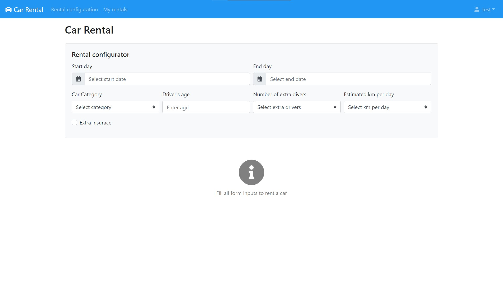

# Exam #1: "Car Rental"
## Student: s280085 PIPERO GIUSEPPE 

## React client application routes

- Route `/login`: login page used to authenticate a user
- Route `/myrentals`: page containing table of rentals, both past (and current) and future. It is also redirected by car rental configuration after that a rental has been payed. It this case, Redirect component also assigns a state indicating whether initialize the rental list with future rentals or pasts.
- Route `/`: load a page with car list if not authenticated, otherwise load a page with car rental configurator

## REST API server

- POST `/api/login`
  - request body content: username, password
  - response body content: username in case of success, status(500) in case of failure, sending a json object to describe the error (wrong username/password etc.)
- GET `/api/public`
  - request parameters: none
  - response body content: list of cars
- POST `/api/logout`
  - request parameters: none
  - response body content: none
- GET `/api/user`
  - request parameters: username (from req.user)
  - response body content: username
- GET `/api/availability`
  - request parameters: startDate, endDate, category
  - response body content: json object containing total number of cars of the given category and number of available cars of that category in the specified period
- POST `/api/pay`
  - request body content: cardNumber, cvv, expDate, fullName
  - response body content: status (true or false) indicating if operation succeed or not
- POST `/api/addrental`
  - request body content: startDate, endDate, price, category
  - response body content: status (true) if operation succeed
- GET `/api/isfrequent`
  - request parameters: username (from req.user)
  - response body content: number of past rentals of specified user
- GET `/api/getrentals`
  - request parameters: future (indicating whether getting future rentals or currents and pasts)
  - response body content: list of rentals
- GET `/api/delete`
  - request parameters: reservationId
  - response body content: status (true) if operation succeed
## Server database

- Table `car` - contains id brand model category
- Table `user` - contains username password
- Table `rental` - contains id startDate endDate category price user

## Main React Components

- `CarListBody` (in `CarListBody.js`): shows list of cars. Provides filters (using Typeahead component from react-bootsrap-typeahead module) to select cars based on brand and category. Every time a filter changes, cars are dinamically filtered (locally) and result is shown in real time.
- `CarRentalConfig` (in `CarRentalConfig.js`): contains configurator form with all necessary fields to retrive available cars and corresponding price. Configurator form is validated using HTML5 validator which check if all inputs are defined and if age is greater or equal than 18. Result is dinamically re-rendered every time an input form changes. If there are available cars, shows number of cars, rental price per day and a button to rent the solution, which open the payment modal.
- `PaymentModal` (in `CarRentalConfig.js`): defines modal containing the payment form to be filled with credit card information. Fields are validated using HTML5 validator, with a basic validation which check presence and correct type of data (i.e. constraint on length of credit card number). Modal is shown if "show" property is passed as true.
- `LoginForm` (in `LoginForm.js`): shows login form, which is validated using HTML5 validation, every time form is submitted. If form is valid, it calls login function located in App.js and passed to the component as a callback. In case of error, form also shows type of error near the input control (i.e. missing username/password, wrong username/password), returned by login API request.
- `NavBar` (in `NavBar.js`): shows a custom bootstrap Navbar. It is rendered in different ways if user is logged or not. If logged, it shows logo and app name, a link to rental configuration page, a link to personal rentals page, and a drop down menu in the right, containing username and logout button. In case of no user is logged, it shows just logo and appname and a link in the right which redirect to login page.

## Screenshot

## Test users

* test, admin (frequent customer)
* user1, pass
* user2, pass
* user3, pass
* user4, pass
